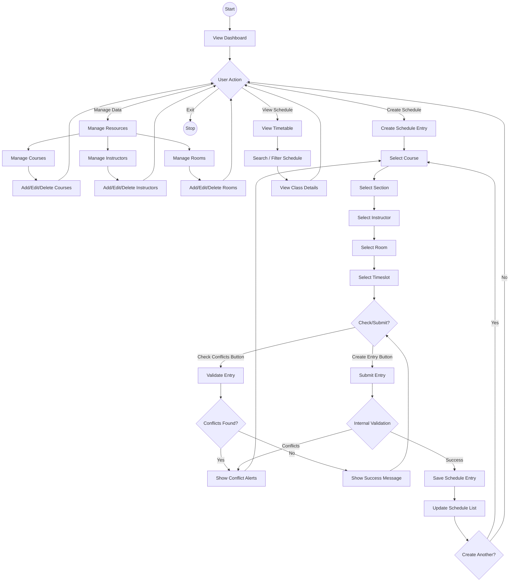

# Activity Diagram - Class Scheduler Pro

## Description
1. **Start**: User lands on the Dashboard.
2. **Navigation**: User chooses between Managing Data, Creating Schedule, or Viewing Schedule.
3. **Manage Data**: User can add, update, or remove Courses, Instructors, and Rooms.
4. **Create Schedule**:
    - The core activity is selecting a tuple of (Course, Section, Instructor, Room, Timeslot).
    - The system filters Sections based on Course.
    - The system filters Rooms based on Course Type (e.g., Lab vs Lecture).
    - User can manually check for conflicts before submitting.
    - Upon submission, the system validates again. If conflicts exist, they are displayed.
    - If valid, the entry is saved.
5. **View Schedule**: User can check the final timetable and search for specific entries.
