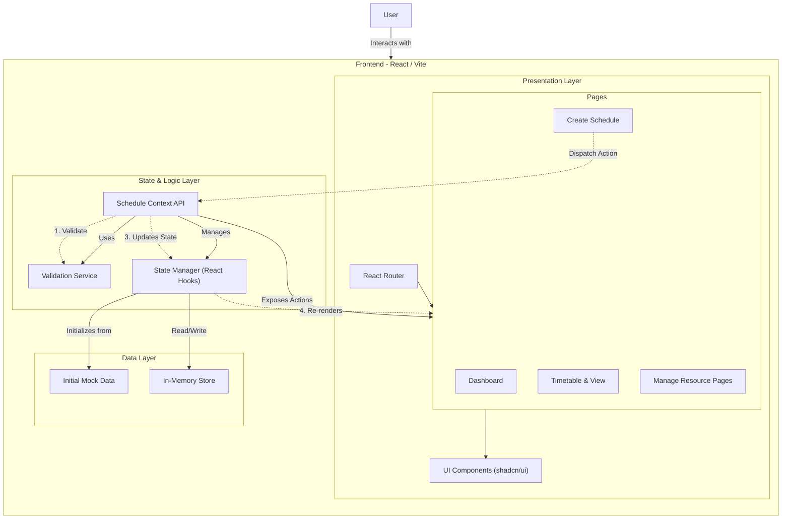

# High-Level Architecture - Class Scheduler Pro

## Architecture Overview

The **Class Scheduler Pro** is a **Client-Side Single Page Application (SPA)** built with **React**. It utilizes a centralized Context API for state management and business logic, operating entirely in the browser without a persistent backend database in its current iteration.

### Key Components

1.  **Presentation Layer (UI)**
    *   **React Router**: Handles navigation between the Dashboard, Schedule Creation, and Timetable views.
    *   **Pages & Components**: Built using modular components (shadcn/ui) and Tailwind CSS for styling. They are purely presentational and subscribe to data updates.

2.  **Logic Layer (State Management)**
    *   **Schedule Context**: The core "brain" of the application. It provides a global state container accessible by any component.
    *   **Validation Service**: Embedded within the Context, this module validates constraints (conflicts, overlapping times) before any state mutation occurs.
    *   **State Manager**: Uses React's `useState` hooks to manage the lists of Courses, Instructors, Rooms, and Schedule Entries.

3.  **Data Layer**
    *   **In-Memory Store**: Data is held in the browser's memory during the session.
    *   **Initial Data**: The application seeds itself with static data (`initialData.ts`) on load.

### Data Flow Example (Creating a Schedule)
1.  **User** fills out the form on the `CreateSchedule` page.
2.  The Page calls `addScheduleEntry()` exposed by **Schedule Context**.
3.  The Context calls the **Validator** to check for conflicts (Room/Instructor double booking).
4.  If valid, the **State Manager** updates the `scheduleEntries` array.
5.  All listening components (e.g., `Timetable`) automatically re-render with the new data.
